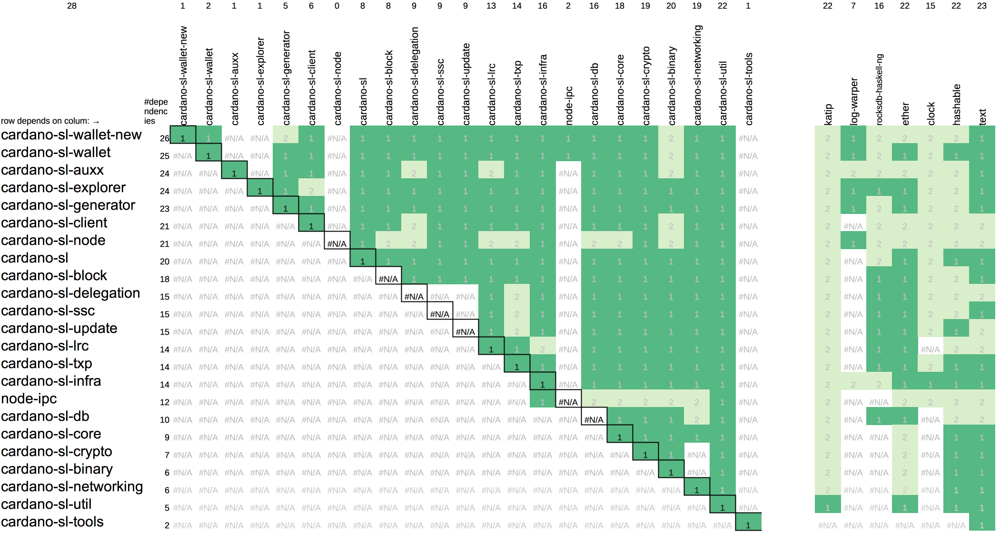

# cabal dependencies

this tool extracts dependencies from Cabal files and prints them as Prolog terms for further processing.

direct dependencies are labelled "1", and transitive dependencies "2".

## extraction

### using `stack`

> stack build

> stack exec cabal-dependencies-exe ../my-other-project/project.cabal  > dependencies.pl

### using `cabal`

> cabal new-build

> cabal new-run cabal-dependencies-exe ../my-other-project/project.cabal  > dependencies.pl

## analysis

prints out a list of all dependencies.

> swipl -q -t go depdep.pl > dependencies.csv

prints out a list of modules defined by the cabal files.

> swipl -q -t go2 depdep.pl > modules.csv

## example

analysed the dependencies in a huge project ([Cardano-SL](https://github.com/input-output-hk/cardano-sl)).

this project contains more than 20 modules.

the CSV data have been loaded into a LibreOffice [calc sheet](module_dependencies.ods) for visualisation.

